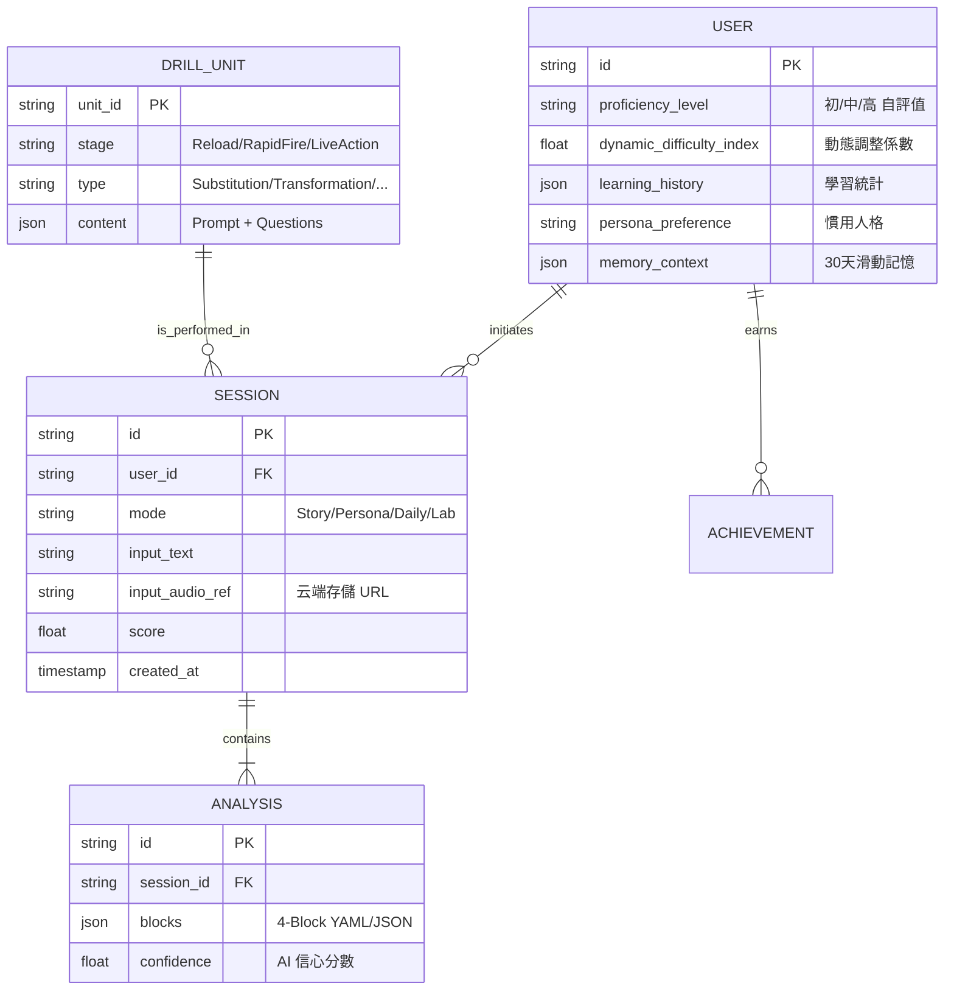

# Data Model: AI Language Training OS

## 實體關係圖 (ERD)

## 關鍵欄位定義與約束
- **User.memory_context**: 陣列結構 `[{id, text, topic, created_at}]`。
- **Analysis.blocks**: 嚴格對齊 4-Block 維度 (Word/Collocation/Phrase/Clause)。
- **Session.score**: 在 Unit 30 中依據 A 方案權重 (40/30/30) 計算。
